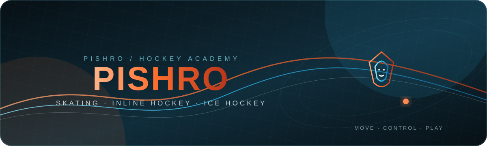

<div align="center">
  

  # 🐯 Pishro Hockey

  **Skating · Inline Hockey · Ice Hockey**

  <p>Responsive RTL website with public teams, player profiles, coaching staff, a hockey blog, moderated comments, contact inbox, and a PHP/MySQL admin panel.</p>

  <a href="https://github.com/parsaahady/pishro-academy">
    
  </a>

  
  
  
  
  
</div>

---

## Overview

Pishro Hockey is a Persian RTL website for a skating and hockey academy. It combines a polished static frontend with a PHP/MySQL backend for managing teams, players, coaches, blog content, comments, contact requests, and uploaded images.

The frontend is written in HTML, CSS, and vanilla JavaScript. The backend uses PDO, prepared statements, PHP sessions, password hashing, CSRF protection, server-side validation, and controlled image uploads.

## Features

### Public website

- Responsive RTL layout for desktop, tablet, and mobile
- Pishro tiger branding and academy photography
- Animated hero, quick navigation, scroll effects, and image interactions
- Training programs for beginner skating, inline hockey, and ice hockey
- Training plans and pricing section
- Team directory and public player profiles
- Coach directory with experience, specialties, biography, and image
- Blog index with featured posts and category filters
- Blog detail pages with:
  - Rich article content
  - Image albums
  - Approved comments
  - Share-link action
- Moderated blog comments
- Contact and consultation forms
- Public roster preview on the homepage
- Location, equipment, achievements, FAQ, and gallery sections

### Admin panel

- Server-side login with secure PHP sessions
- Password verification using `password_hash()` and `password_verify()`
- Session-based login throttling
- CSRF protection for admin write requests
- Player management: create, edit, delete, search, and image upload
- Coach management: create, edit, delete, and image upload
- Blog editor with:
  - Title, slug, category, excerpt, and publish status
  - Rich text toolbar
  - Server-sanitized HTML
  - Cover image upload
  - Multiple-image album upload
  - Draft and published states
- Contact inbox for consultation requests and selected plans
- Comment moderation: pending, approved, rejected, and delete
- Database-backed counters and public content

## Project Structure

```text
pishro-academy/
├── index.html
├── teams.html
├── team.html
├── coaches.html
├── blog.html
├── post.html
├── admin.html
├── styles.css
├── api-client.js
├── app.js
├── teams.js
├── team-page.js
├── coaches.js
├── blog.js
├── post.js
├── admin.js
├── api/
│   ├── config.example.php
│   ├── bootstrap.php
│   ├── auth.php
│   ├── media.php
│   ├── setup.php
│   ├── auth/
│   │   ├── login.php
│   │   ├── logout.php
│   │   └── me.php
│   ├── public/
│   │   ├── teams.php
│   │   ├── players.php
│   │   ├── coaches.php
│   │   ├── blogs.php
│   │   ├── comments.php
│   │   ├── contact.php
│   │   ├── stats.php
│   │   ├── media.php
│   │   └── player-image.php
│   └── admin/
│       ├── players.php
│       ├── coaches.php
│       ├── blogs.php
│       ├── comments.php
│       └── messages.php
├── database/
│   ├── schema.sql
│   ├── seed.sql
│   └── .htaccess
├── uploads/
│   ├── players/
│   ├── coaches/
│   └── blogs/
├── assets/
│   ├── pishro-banner.svg
│   └── gallery/
└── README.md
```

## Requirements

- PHP 8.2 or newer
- PDO MySQL extension
- MySQL 5.7+ or MariaDB 10.4+
- Apache or Nginx
- HTTPS in production
- Writable upload directories
- `upload_max_filesize` of at least 4M
- `post_max_size` of at least 8M

## Local Development

The frontend can be previewed with a static server, but the admin panel and database API require PHP and MySQL.

### Frontend preview only

```bash
python -m http.server 5500
```

Open:

```text
http://localhost:5500
```

### Full local setup

Use a PHP/MySQL environment such as XAMPP, Laragon, MAMP, Docker, or a PHP-enabled hosting environment. Configure `api/config.php` before using the admin panel.

## Server Setup

### 1. Create the database

Create a MySQL database and database user in cPanel or your hosting panel. Grant the user full permissions for the database.

### 2. Configure the API

Copy:

```text
api/config.example.php → api/config.php
```

Then edit the database and application settings:

```php
return [
    'db' => [
        'host' => 'localhost',
        'name' => 'your_database_name',
        'user' => 'your_database_user',
        'pass' => 'your_database_password',
        'charset' => 'utf8mb4',
    ],
    'app' => [
        'cookie_secure' => true,
        'max_upload_bytes' => 3 * 1024 * 1024,
        'upload_dir' => dirname(__DIR__) . '/uploads/players',
        'upload_url' => 'uploads/players',
        'blog_upload_dir' => dirname(__DIR__) . '/uploads/blogs',
        'blog_upload_url' => 'uploads/blogs',
        'coach_upload_dir' => dirname(__DIR__) . '/uploads/coaches',
        'coach_upload_url' => 'uploads/coaches',
        'setup_enabled' => true,
        'setup_token' => 'replace-with-a-long-random-token',
    ],
];
```

`api/config.php` is ignored by Git and must not be committed to a public repository.

### 3. Upload the project

Upload the project contents to the domain document root, usually:

```text
public_html/
```

Required paths:

```text
public_html/index.html
public_html/admin.html
public_html/api/
public_html/assets/
public_html/uploads/
```

### 4. Create the database and first admin

The database tables and sample blog posts are defined in:

```text
database/schema.sql
database/seed.sql
```

You can import them through phpMyAdmin. Alternatively, run the one-time setup endpoint after configuring `api/config.php`:

```bash
curl -X POST "https://your-domain.com/api/setup.php?token=YOUR_SETUP_TOKEN" \
  -H "Content-Type: application/json" \
  -d '{"username":"admin","display_name":"Pishro Admin","password":"replace-with-a-strong-password"}'
```

After setup succeeds:

1. Set `setup_enabled` to `false` in `api/config.php`.
2. Delete `api/setup.php` from the server.
3. Keep the admin password and setup token private.

### 5. Set upload permissions

The web server must be able to write to:

```text
uploads/players/
uploads/coaches/
uploads/blogs/
```

Use `755` or `775` only when required by the host. The included `.htaccess` files block common script extensions inside upload directories.

## Admin Panel

Open:

```text
https://your-domain.com/admin.html
```

The admin login is checked by PHP. Credentials are not stored in frontend JavaScript.

### Player management

Add player details, assign a team, upload an image, and manage the public roster.

### Coach management

Create coach profiles with role, years of activity, specialties, biography, and image.

### Blog management

Create a new post from the built-in editor. A post supports:

- English slug
- Category
- Draft or published status
- Excerpt
- Rich text content
- Cover image
- Multiple gallery images

Blog HTML is sanitized server-side before storage to remove scripts, unsafe attributes, and unsafe URLs.

### Messages and comments

Consultation form submissions are stored in the `contact_messages` table. Blog comments are stored as `pending` and must be approved from the admin panel before they appear publicly.

## API Endpoints

| Method | Endpoint | Purpose |
|---|---|---|
| `POST` | `/api/auth/login.php` | Admin login |
| `POST` | `/api/auth/logout.php` | End admin session |
| `GET` | `/api/auth/me.php` | Check current session |
| `GET` | `/api/public/teams.php` | List active teams |
| `GET` | `/api/public/players.php?team=kids` | Public roster |
| `GET` | `/api/public/coaches.php` | Public coaching staff |
| `GET` | `/api/public/blogs.php` | Published blog posts |
| `GET` | `/api/public/blogs.php?slug=...` | Published post detail |
| `POST` | `/api/public/comments.php` | Submit a pending comment |
| `POST` | `/api/public/contact.php` | Store a consultation request |
| `GET` | `/api/public/stats.php` | Public roster statistics |
| `GET` | `/api/admin/players.php?team=kids` | Admin roster |
| `POST` | `/api/admin/players.php` | Create or update player |
| `DELETE` | `/api/admin/players.php?id=123` | Delete player |
| `GET` | `/api/admin/coaches.php` | Admin coach list |
| `POST` | `/api/admin/coaches.php` | Create or update coach |
| `DELETE` | `/api/admin/coaches.php?id=123` | Delete coach |
| `GET` | `/api/admin/blogs.php` | Admin blog list |
| `POST` | `/api/admin/blogs.php` | Create or update blog |
| `DELETE` | `/api/admin/blogs.php?id=123` | Delete blog |
| `GET` | `/api/admin/messages.php` | Admin contact inbox |
| `GET` | `/api/admin/comments.php` | Admin comment queue |

Admin write requests require a valid authenticated session and CSRF token.

## GitHub Pages

GitHub Pages can host the public static frontend, but it cannot run PHP or MySQL. The complete version with admin, blog management, comments, messages, and image uploads must be deployed to a PHP/MySQL host.

GitHub can remain the source-code repository. For the public-only version:

1. Push the project to GitHub.
2. Open **Settings → Pages**.
3. Select **Deploy from a branch**.
4. Select the `main` branch and `/ (root)`.
5. Save.

Expected URL for `parsaahady/pishro-academy`:

```text
https://parsaahady.github.io/pishro-academy/
```

## Security Checklist

- Do not commit `api/config.php`.
- Use HTTPS and set `cookie_secure` to `true`.
- Disable and remove `api/setup.php` after the first setup.
- Use a unique admin password.
- Keep the database credentials private.
- Keep upload directories protected from script execution.
- Review and approve comments before publication.
- Back up the database and upload directories regularly.

## License

No open-source license has been added yet. Add a license before distributing or reusing the project publicly.

<div align="center">
  <br />
  <strong>🐯 Pishro Hockey</strong>
  <br />
  <sub>Move · Control · Play</sub>
</div>
